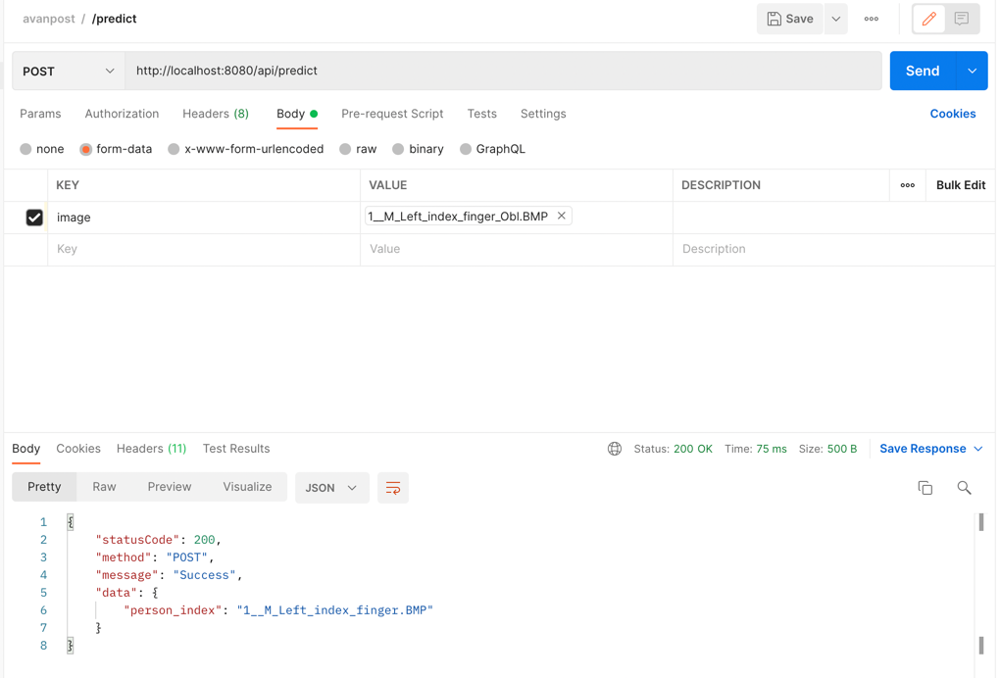

# Сравнение отпечатков пальцев
## Задача: 
Реализовать алгоритм сравнения отпечатков пальцев на языке Go. На вход передается отпечаток с разрешением 500 dpi размером 440x500. Отпечаток сравнивается с базой отпечатков, составленной из датасета SOCOFing.

Данный датасет состоит из 6000 изображений от 600 личностей, по 1 отпечатку для каждого пальца. Также в датасете имеются аугментации изображений разной силы.
По входному изображению (не из базы) требуется найти данный отпечаток в базе. Для тестирования точности работы алгоритма будет выдан тестовый сет изображений отпечатков с метками. Необходимо посчитать метрикy качества работы алгоритма, а именно точность (accuracy).
Алгоритм должен масштабироваться горизонтально (увеличение числа ядер процессора), максимальное время сравнения с образцом - 2 секунды. Необходимо предоставить результаты времени работы алгоритма в зависимости от используемого числа ядер (потоков).

## Как запустить:

```
    git clone https://github.com/kkkooolllyyyaaa/fingerprintRecognitionAvanpost.git
    <Загрузить тренировочные и тестовые данные>
    docker build -t "solve" .
    docker run -p 8080:8080 solve
```

## Api:
### `Post /api/predict`
```
curl --location --request POST 'http://localhost:8080/api/predict' \
--form 'image=@"<filepath>"'
```

### `Response`
```
{
    "statusCode": 200,
    "method": "POST",
    "message": "Success",
    "data": {
        "person_index": "1__M_Left_index_finger.BMP"
    }
}
```

### Пример из Postman


## Решение:
Архитектура, описание решения и алгоритм Coming soon

## Результат на тестовых данных:

```
    easy-accuracy: 0.98
    medium-accuracy: 0.85
    hard-accuracy: 0.70
    test-accuracy: 0.65 (пока)
```
